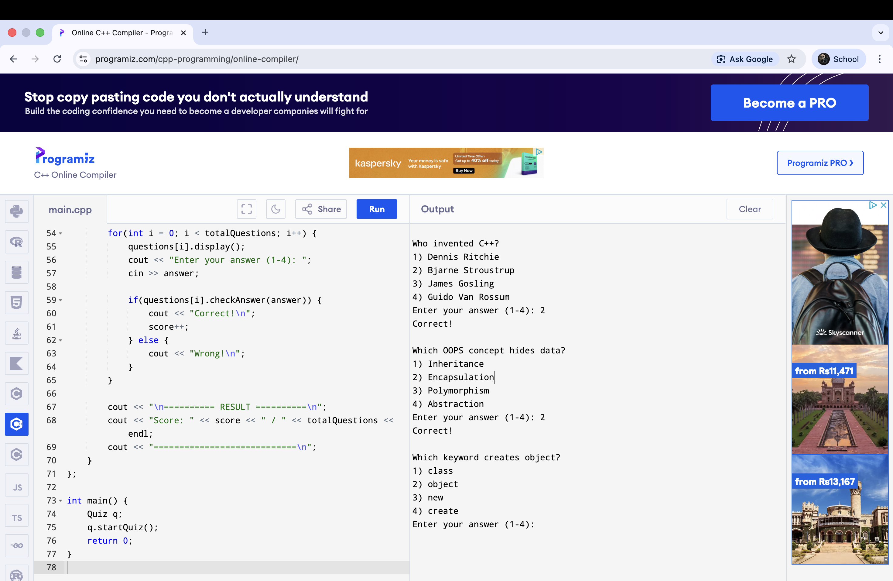

# Quiz App – C++ (Object Oriented Programming)

This is a C++ based Quiz Application developed using Object-Oriented Programming concepts.  
The application displays multiple-choice questions, takes user input, validates answers, and finally displays the score.

---

## 🚀 Features
✔️ Multiple-choice quiz questions  
✔️ User input answer selection  
✔️ Answer validation  
✔️ Score calculation  
✔️ Clean and beginner-friendly implementation  
✔️ 100% Object-Oriented design

---

## 🧠 OOPS Concepts Used
- Classes and Objects  
- Encapsulation  
- Constructors  
- Member Functions  
- Array of Objects

---

## 📂 How to Run the Program

1️⃣ Save the file as `quiz.cpp`  
2️⃣ Open your terminal / command prompt  
3️⃣ Compile the program:

## 📸 Program Demo

